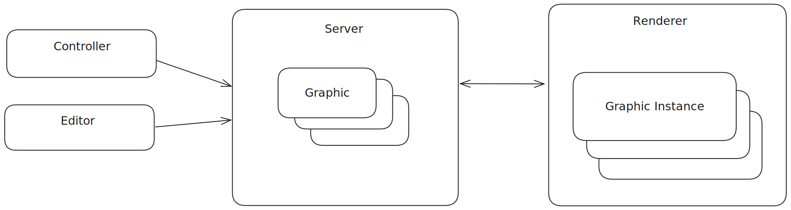
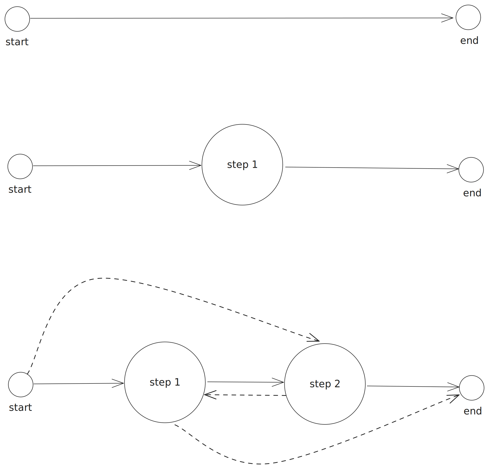

# EBU OGraf

## About

EBU OGraf is a specification for Web-based Broadcast Graphics.
It allows users to create a Graphic once and use it in multiple compatible Graphic renderers.

## Introduction

A Web-based Graphic is implemented using standardized Web technologies (e.g. HTML, Javascript, CSS, Canvas, Web
Components, ...) and can be rendered with engines implementing these Web technologies (e.g. browsers or browser engines
such as Blink and WebKit).

A Web-based Graphics workflow typically consists of the following components (see figure below):
* Editor: an application or service where a user can create and edit Graphics.
* Controller: a user interface or automation layer controlling the playout of the Graphics.
* Server: provides the API endpoints for the controllers and editors. They consist of managing graphics
  (importing/exporting/listing graphics) and graphics control (i.e. playout of the graphics). The latter is done by
  sending/receiving commands to/from the Renderer.
* Renderer: is able to render one or more Web-based graphic instances. Based on incoming commands from the Server, a
  Graphic is animated in, updated or animated out. In order to achieve this, communication between the Renderer and the
  Graphic instance is necessary.



Although vendors usually provide all components in one solution, allowing optionally third-party Editors and Controllers
(typically automation layers), it is certainly possible to see each of the different parts (Editor, Controller,
Server, and Renderer) coming from different vendors.

The scope of this specification is the format definition of a Graphic and how a Renderer should interpret this format
in order to render the Graphic. Graphic creators (developers and tools) producing Graphics compatible with this format
are guaranteed that these Graphics can be rendered in compliant Renderers. This enables more straightforward
exchanges between different Web-based graphic engine solutions and can support use cases such as marketplaces for Web-based Graphics.

## Use of Normative Language

The key words "MUST", "MUST NOT", "REQUIRED", "SHALL", "SHALL NOT", "SHOULD", "SHOULD NOT", "RECOMMENDED", "MAY", and "OPTIONAL" in this document are to be interpreted as described in [RFC 2119](https://www.ietf.org/rfc/rfc2119.txt).

## Requirements for a Graphic

A Graphic MUST consist of the following files:

- a JSON file containing metadata about the Graphic, referred to as the Manifest file.
  See [Manifest Model](#manifest-model) for more information.
- a Javascript file that exports the Graphic Web Component. The Manifest file MUST contain a reference to this Javascript file.
  See [Web Component Interface](#web-component-interface) for more information.
- any resources used by the Graphic, such as images, videos, fonts, etc.
  These resources MAY be organised in a folder structure.

The Manifest file SHOULD be considered as the representation and entrypoint for the Graphic, all other files are either
directly or indirectly referenced from the Manifest file and can be seen as dependencies.

### Manifest Model

The manifest file is a JSON file containing metadata about the Graphic.
The file name of the manifest file MUST end with `.ograf` (e.g. `my-graphic.ograf`).
It consists of the following fields:

| Field               | Type               | Required | Default | Description                                                                                                                                                        |
|---------------------|--------------------|:--------:|:-------:|--------------------------------------------------------------------------------------------------------------------------------------------------------------------|
| $schema             | string             |    X     |         | MUST be the string "https://ograf.ebu.io/v1/specification/json-schemas/graphics/schema.json". <br /> This doubles as a reference to the JSON Schema of the manifest file as well as a OGraf version. |
| id                  | string             |    X     |         | A unique identifier for the Graphic. Can consist of any unicode character, except "/" (forward slash). |
| version             | string             |          |         | A version descriptor of the Graphic. The versioning scheme is beyond the scope of this specification.                                                              |
| name                | string             |    X     |         | The name of the Graphic.                                                                                                                                           |
| description         | string             |          |         | A longer description of the Graphic.                                                                                                                               |
| author              | Author             |          |         | An object providing information about the author of the Graphic. When provided, the object MUST contain a `name` field and MAY contain an `email` and `url` field. |
| main                | string             |    X     |         | Reference to the Javascript file that exports the Graphic Web Component.                                                                                           |
| customActions       | Action[]           |          |         | An array of `Action` objects. They correspond to the custom actions that can be invoked on the Graphic. See below for details about the fields inside an `Action`.    |
| supportsRealTime    | boolean            |    X     |         | Indicates whether the Graphic supports real-time rendering.                                                                                                        |
| supportsNonRealTime | boolean            |    X     |         | Indicates whether the Graphic supports non-real-time rendering. If true, the Graphic MUST implement the non-real-time functions `goToTime()` and `setActionsSchedule()`.                 |
| schema              | object             |          |         | The JSON schema definition for the `data` argument to the `load()` and `updateAction()` methods. This schema can be seen as the (public) state model of the Graphic.                   |
| stepCount           | integer            |          |    1    | The number of steps a Graphic consists of.                                                                                                                         |
| renderRequirements  | RenderRequirement[]|          |         | A list of requirements that this Graphic has for the rendering environment. At least one of the requirements must be met for the graphic to be expected to work.   |

There MAY be multiple manifest files in a folder. In the case of multiple manifest files, will be interpreted as multiple, independent Graphics.
(This can be useful for example when having a package of multiple OGraf graphics, which then might share resources such as images, fonts, etc.)

#### Real-time vs. non-real-time

Real-time rendering of a Graphic means that the Graphic is animated at real-time speed, typically in the context of live TV.
Non-real-time rendering has no requirement on the speed of rendering, it can be slower or faster than real-time and is
typically used in post-production scenarios. A Graphic MUST be either marked as real-time, non-real-time or both,
by means of the `supportsRealTime` and `supportsNonRealTime` fields.

In case of a non-real-time Graphic, there are two additional functions that need to be implemented by the Graphic:
`goToTime()` and `setActionsSchedule()` (see [Web Component Interface](#web-component-interface) for their definition).

#### Step model

A Graphic contains zero or more steps. A step can be defined as a 'paused' state of the Graphic.
Going from one step to another is done via a transition (with or without animation). The figure below shows three example
step models. Every model has a start and an end node. The start node represents the start of a Graphic rendering, where
typically nothing is visible in the rendered output. Similarly, the end node represents the end of the Graphic rendering,
also typically nothing visible in the rendered output at that moment. The arrows between the nodes represent the transitions.

The first model represents a Graphic containing zero steps. When `playAction()` is called on this Graphic, it will
animate the Graphic in and after some predefined time the Graphic will animate out automatically.

The second model represents a Graphic containing one step. When `playAction()` is called on this Graphic, it will
animate the Graphic in and will pause at step 1. Pausing here doesn't mean that the Graphic is not moving, it refers to
the fact that there is an interaction necessary with the Graphic to move to the next step (in this case the end).
The `stopAction()` function SHOULD be used to go to the end of the Graphic.

The third model represents a multi-step Graphic containing two steps. It is similar to the one-step model,
but now the `playAction()` function MUST be used again to transition between different steps, except for the end node, where the `stopAction()`
function SHOULD be used. The normal flow is to go to step 1, then to step 2 and finally to the end node. However, it is
possible that you transition to any step or directly to the end node (indicated by the dotted lines in the figure).



#### Custom actions

A custom action is an action that is specific for a particular Graphic. It is a mechanism to support any action
a Graphic can execute. The Manifest file defines the custom actions by means of the `actions` field. It represents
a Map where the keys correspond to the id of the custom action and the values are `Action` objects. The `Action` object
supports the following fields:

| Field       | Type   | Required | Default | Description                                               |
|-------------|--------|:--------:|:-------:|-----------------------------------------------------------|
| id          | string |    X     |         | The identity of the action. The id must be unique within the graphic.                               |
| name        | string |    X     |         | The name of the action (for use in GUIs).                 |
| description | string |          |         | A longer description of the action.                       |
| schema      | object |          |         | The JSON schema definition for the payload of the action. |

#### RenderRequirements

A RenderRequirement in the manifest file is an object that describes which requirements a Graphic has for the rendering environment.
The `renderRequirements` is a list of RenderRequirements, where at least one requirement must be fulfilled by the renderer for a
Graphic to be expected to work.

The RenderRequirement object contains the following fields:


| Field             | Type             | Required | Default | Description                                               |
|-------------------|------------------|:--------:|:-------:|-----------------------------------------------------------|
| resolution        | object           |          |         | Object that describes resolution requirements. |
| resolution.width  | NumberConstraint |          |         | Specifies renderer width resolution requirement. |
| resolution.height | NumberConstraint |          |         | Specifies renderer height resolution requirement. |
| frameRate         | NumberConstraint |          |         | Specifies renderer frameRate requirement. |

##### NumberConstraint

A NumberConstraint is an object that describes a constraints for a numerical value.
(This is inspired by https://developer.mozilla.org/en-US/docs/Web/API/MediaTrackConstraints#constraindouble)
It contains the following fields:

| Field             | Type             | Required | Default | Description                                               |
|-------------------|------------------|:--------:|:-------:|-----------------------------------------------------------|
| max               | number           |          |         | A number specifying the largest permissible value of the property it describes. If the value cannot remain equal to or less than this value, matching will fail. |
| min               | number           |          |         | A number specifying the smallest permissible value of the property it describes. If the value cannot remain equal to or greater than this value, matching will fail. |
| exact             | number           |          |         | A number specifying a specific, required, value the property must have to be considered acceptable. |
| ideal             | number           |          |         | A number specifying an ideal value for the property. If possible, this value will be used, but if it's not possible, the user agent will use the closest possible match. |

##### StringConstraint

A StringConstraint is an object that describes a constraints for a textual value.
(This is inspired by https://developer.mozilla.org/en-US/docs/Web/API/MediaTrackConstraints#constraindouble)
It contains the following fields:

| Field             | Type             | Required | Default | Description                                               |
|-------------------|------------------|:--------:|:-------:|-----------------------------------------------------------|
| exact             | string           |          |         | A string specifying a specific, required, value the property must have to be considered acceptable. |
| ideal             | string, string[] |          |         | A string (or an array of strings), specifying ideal values for the property. If possible, one of the listed values will be used, but if it's not possible, the user agent will use the closest possible match. |

#### Vendor-specific fields

Vendor-specific fields are additional fields that are not part of this specification, but used for vendor-specific means.
They can occur in the Manifest file or in the payload of the requests/responses for each of the functions in the Web Component.
Every vendor-specific field MUST use the prefix `v_`. For example, `v_editor` is a valid vendor-specific field, `editor` is not a valid field.

### Web Component Interface

A Graphic MUST be implemented in the form of a custom HTML element (i.e. a Web Component).
The [HTML5 Custom Elements specification](https://html.spec.whatwg.org/multipage/custom-elements.html) defines the
requirements for such a custom HTML element.

Therefore, the contents of the `main` Javascript file of a Graphic MUST contain a `class` that extends from `HTMLElement`.
Depending on the rendering capabilities (defined in the Manifest file), a Graphic is expected to implement a number of functions.

To describe the functions in this document, the Typescript interface notation is used. For simplicity, we omit the indication
that vendor-specific fields can be included in both request and response payloads.
For the 'action' methods (`playAction()`, `stopAction()`, `updateAction()` and `customAction()`), a Promise MUST be returned that
resolves to `undefined` or to an `ReturnPayload` object containing the following fields:
* `code`: a number that corresponds to an HTTP status code (2xx indicates a successful result, 4xx and 5xx indicate an error).
* `message`: an optional human-readable message that corresponds to the `code`.
* `result`: an optional Graphics-specific response object.
If the returned Promise resolves to `undefined`, it should be treated as a `{ code: 200 }`.

Similarly, for simplicity reasons, we omit these three fields in the description of the functions below.
In [Typescript interface](#typescript-interface-for-graphic), the full interface is provided.


Every Graphic MUST implement the following functions:
* `load: ({ data:any }) => Promise<ReturnPayload>`: Called by the Renderer when the Graphic has been loaded into the DOM.
  The `data`-payload MUST contain the initial internal state of the Graphic.
  The schema of the `data`-payload of this function is described in the Manifest using the `schema` field.
  A Promise is returned that resolves when everything is loaded by the Graphic.
* `dispose: ({}) => Promise<ReturnPayload>`: Called by the Renderer to force the Graphic to terminate/dispose/clear any loaded resources. A Promise
  is returned that resolves when the Graphic completed the necessary cleanup.
* `playAction: ({delta: number, goto: number, skipAnimation: boolean}) => Promise<PlayActionReturnPayload>`:
  Called by the Renderer to play a given step. The `skipAnimation` field indicates whether the Graphic should transition with or without animation.
  The `delta` and `goto` fields indicate the target step; `delta` is used for relative steps, `goto` for an absolute step number. When the target
  step number is higher or equal to the `stepCount` defined in the Manifest, the Graphic MUST transition to the end. The returned Promise
  resolves to an `ReturnPayload` object with an additional `currentStep` field which indicates the current step after the execution of the `playAction()` function.
  In case `stepCount` is equal to zero or the `playAction()` function is used to transition to the end, the `currentStep` field in the response is `undefined`.
* `stopAction: ({skipAnimation: boolean}) => Promise<ReturnPayload>`: Called by the Renderer to stop the Graphic from being displayed.
  This can be with or without animation, depending on the value of the `skipAnimation` field. The returned Promise resolves to an `ReturnPayload` object.
* `updateAction: ({ data: any }) => Promise<ReturnPayload>`: Called by the Renderer to update one or more fields of the internal state of the Graphic. The schema of the
  `data`-payload of this function is described in the Manifest using the `schema` field. The returned Promise resolves to an `ReturnPayload` object.
* `customAction: ({ id: string, payload: any}) => Promise<ReturnPayload>`: Called by the Renderer to invoke a custom action on the Graphic.
  The `id` field MUST correspond to an `id` of an Action that is defined in the Manifest file, inside the `actions` field.
  The schema for the `payload` field is the described in the corresponding Action inside the Manifest file. A Promise
  is returned that resolves to an `ReturnPayload` object when the action is executed.

Additionally, every non-real-time Graphic MUST implement the following functions:
* `goToTime: ({timestamp: number}) => Promise<ReturnPayload>`: Called to make the Graphic jump to a certain `timestamp`, expressed in milliseconds. A Promise is returned with an `ReturnPayload` that resolves when the frame is rendered at the requested position.
* `setActionsSchedule: (payload: {schedule: {timestamp: number, action: {type, params}}}) => Promise<ReturnPayload>`: Called to schedule actions to be invoked at a certain point in time. When this is called, the Graphic is expected to store the scheduled actions and invoke them when the time comes. A call to this replaces any previous scheduled actions. For every `timestamp`, expressed in milliseconds, an action type is provided together with corresponding parameters. The action type is either `playAction`, `stopAction`, `updateAction` or the id of a custom action.

The default export MUST be used to export the `class` representing the Graphic.
This type of export allows you to import the Graphic using any name.


## Requirements for a Renderer

The way a Graphic is added into a Renderer is non-normative.
Different examples are provided [here](TODO) showing how a Graphic can be added to the DOM tree of the Renderer.

When a Graphic is added into a Renderer, the following steps are executed by the Renderer:
* MUST call the `load()` function of the Graphic.
* MUST wait for the promise to resolve.

When a Graphic is removed from the Renderer, the following steps are executed by the Renderer:
* MUST call the `dispose()` function of the Graphic.
* SHOULD wait for the promise to resolve.


## JSON Schema for Manifest file

The normative JSON Schema for the Manifest file can be found [here](../json-schemas/graphics/schema.json).

## Typescript interface for Graphic

The informative Typescript interface for the Graphic Web Component can be found [here](../../typescript-definitions/src/apis/graphicsAPI.ts).

## Examples

### Lower Third

The following manifest describes a simple Lower Third Graphic. It does not contain any custom actions and has one state property: `name`.

```json
{
  "$schema": "https://ograf.ebu.io/v1/specification/json-schemas/graphics/schema.json",
  "id": "l3rd-name",
  "version": "1.0.0",
  "name": "Lower 3rd - Name",
  "description": "Name lower third",
  "author": {
    "name": "John Doe",
    "email": "john.doe@foo.com"
  },
  "main": "lower-third.mjs",
  "schema": {
    "type": "object",
    "properties": {
      "name": {
        "type": "string",
        "title": "Name",
        "default": "John Doe"
      }
    }
  },
  "supportsRealTime": true,
  "supportsNonRealTime": false
}
```

The above manifest refers to the Javascript file `lower-third.mjs`, which is the Web Component implementing this Graphic:

```typescript
class Graphic extends HTMLElement {
  async load({ data: { name: string } } ) {
    // Load resources and initialize
  }
  async dispose() {
    // Dispose the necessary resources, if any
  }
  async playAction({ delta: number, goto: number, skipAnimation: boolean }) {
    // Play the Graphic according to the incoming params
    return {code: 200, message: 'OK', currentStep}
  }
  async stopAction({ skipAnimation: boolean }) {
    // Stop the Graphic, with or without animation
    return {code: 200, message: 'OK'}
  }
  async updateAction({ data: { name: string } }) {
    // Update the state of the Graphic
    return {code: 200, message: 'OK'}
  }
  async customAction({ id: string, payload: any}) {
    return {code: 400, message: 'No custom actions supported'}
  }
}

export default Graphic;
```
